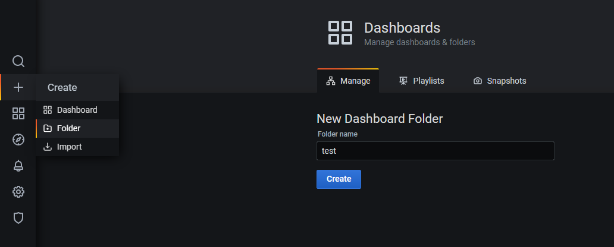

# 格拉法纳(grafana)入门教程
> grafana是数据分析和数据可视化的开源软件，允许查询、数据展示和警报。
## 0.登入
左下角跳转登陆页面，输入账号和密码登入。

## 1.UI界面

#### 搜索
  

查找项目（有大量的项目估计才用得上）

#### 创建文件

新建项目的时候使用。
第一个选项是创建仪表板，第二个选项是创建项目文件夹，最后一个选项是导入项目。

#### 编辑既存文件

选择已有项目编辑。

#### 探索

待补充

#### 警报

设置警报的规则。

设置警报的通知途径。（grafana的通知途径很多，例如发邮件、请求api）

#### 配置

设置数据源、用户、团队、外部程序、偏好和API秘钥。
#### 权限管理

用户管理那一套东西。

## 2.实际操作
### 2.1 准备数据源

配置数据源，目的是连接数据库。

点击'Add data source'按钮，转至配置数据源界面。

Grafana支持的数据库很多，请自行选择项目的数据源。

这里选择MySQL做简单的演示。

填完必要的信息就可以点Sava了，其他选项非必填，可以按需自由探索。

### 2.2 创建工程
新建工程文件夹

新建仪表板

新增一个表

### 2.3 简单的生成几张图